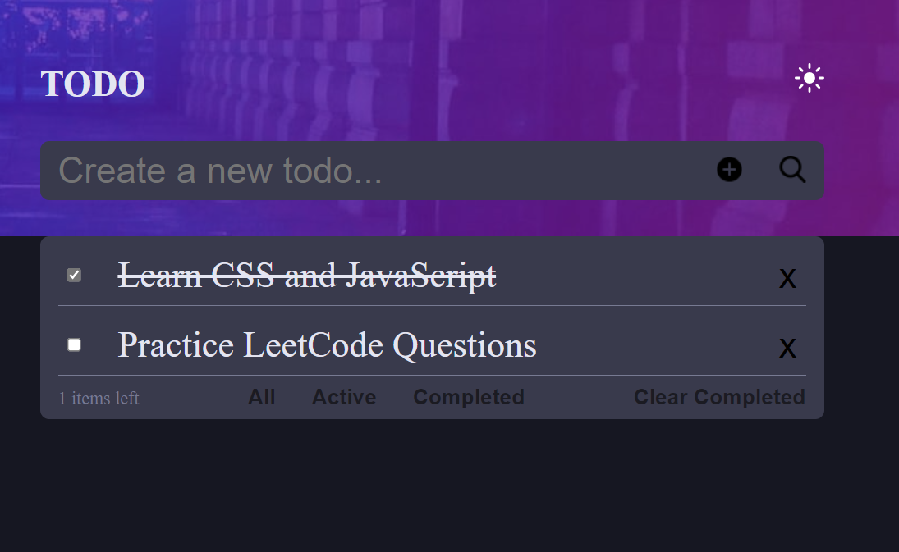

# To-Do List

## Description
This is a simple To-Do List application that allows users to add, manage, and delete tasks. It is built with modern web technologies and aims to provide an intuitive user experience for task management.

## Features
- **Add tasks**: Users can add new tasks to the list.
- **Delete tasks**: Users can delete tasks from the list when completed or no longer needed.
- **User-friendly interface**: Simple and clear layout for task management.

## Screenshot
#### Desktop


## Live Demo
- You can try out the live version of the app here: [Todo List Live Demo](https://ngobe-thabane.github.io/To-Do-List/)

## Built With
- **HTML5**: Semantic HTML markup
- **CSS**: Custom properties and Flexbox layout for responsiveness
- **JavaScript**: Used for dynamic task management functionality

## Installation
If you'd like to run this project locally, you can clone it to your machine and open `index.html` in your browser.

```bash
git clone https://github.com/ngobe-thabane/To-Do-List.git
